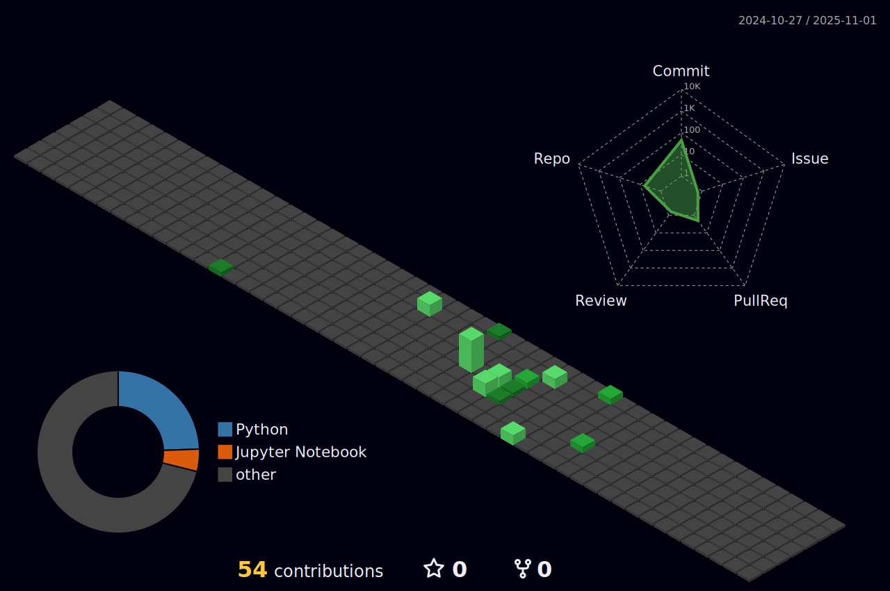

<h1 align="center">👋 Olá, seja muito bem-vindo(a) ao meu GitHub!</h1>

  <strong>Eu sou o Lucas da Silva Santos</strong> 
  Estudante de Análise e Desenvolvimento de Sistemas, 
  Apaixonado por tecnologia, desenvolvimento e por cumprir os propósitos de Deus através do meu trabalho.

### 🛠️ Tecnologias que uso no dia a dia

---

### 📫 Contato

  
  

---

<em>“Entregue o seu caminho ao Senhor; confie nele, e ele agirá.†– Salmos 37:5 âœï¸</em>

